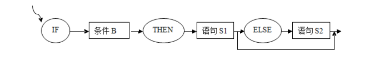
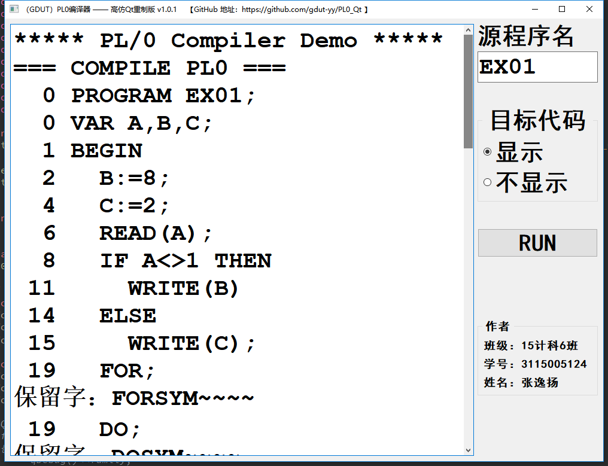
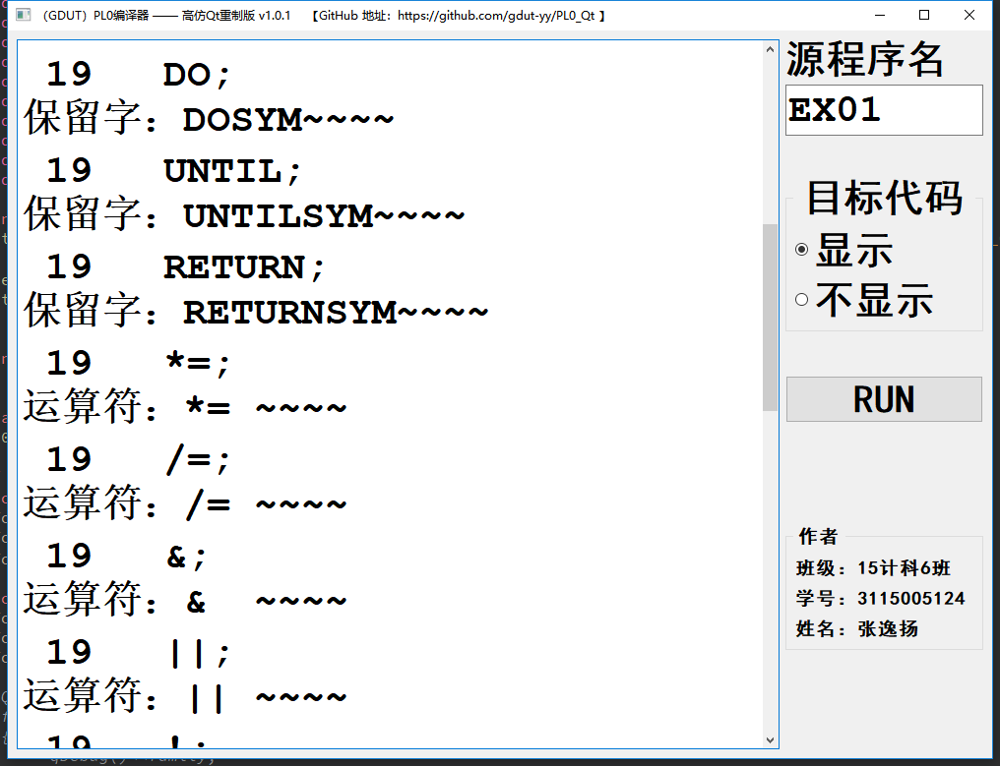
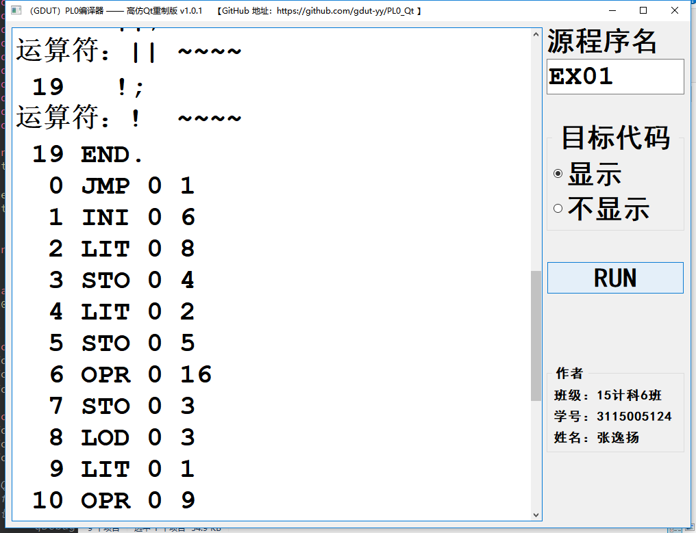
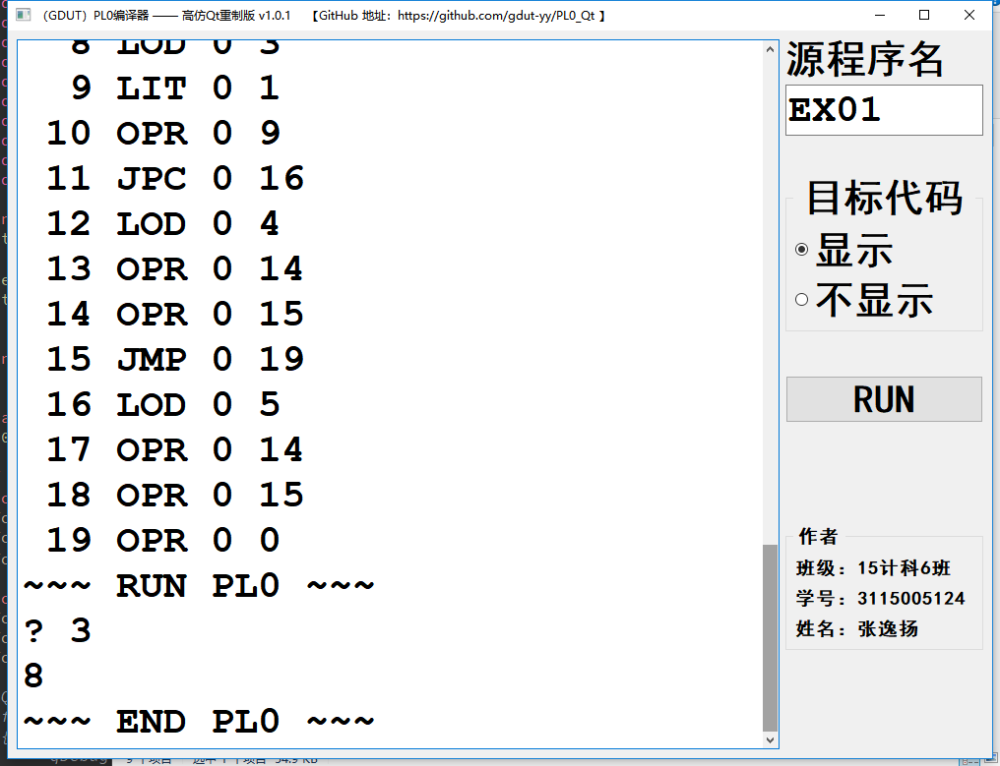

# PL/0 编译器的扩充--实验报告

## 一、实验目的与要求

	对PL/0作以下修改扩充：
	（1）增加单词：保留字 ELSE，FOR，STEP，UNTIL，DO,RETURN 
	             运算符 *=，/=，&，||，！  
	（2）修改单词：不等号# 改为 <>
	（3）增加条件语句的ELSE子句，要求：写出相关文法，语法描述图，语义描述图。

## 二、实验环境与工具 

	1、源语言：PL/0语言，PL/0语言是PASCAL语言的子集，它的编译程序是一个编译解析执行系统，后缀名为.PL0；
	2、目标语言：生成文件后缀为*.COD的目标代码 
	3、实现平台：Borland C++Builder 6 
	4、运行平台：Windows 7 64位 

## 三、结构流程

### （1）PL/0 语言编译器 

PL/0语言可看成是PASCAL语言的子集，它的编译程序是一个编译解释执行系统。PL/0的目标程序为假想栈式计算机的汇编语言，与具体计算机无关。

## 四、实验过程

### （一）增加单词：保留字 ELSE，FOR，STEP，UNTIL，DO,RETURN 运算符 *=，/=，&，||，！

解读：新增6个保留字和5个运算符，合计11个单词。但由于源码中已有DO保留字，所以，只需增加5个保留字和5个运算符即可。

注：要求只做词法分析部分，不做语义分析处理，实验的结果只是识别新增的保留字和运算符，并且将其打印显示出来。

**1.首先参照已有的保留字，进行相应的命名和添加规范，再将新增的保留字添加对应的保留字的集合中。具体实现的语句如下所示：**

| 保留字 | ELSE | FOR | STEP | UNTIL | DO | RETURN |
| - | - | - | - | - | - | - |
| SYM表示 | ELSESYM | FORSYM | STEPSYM | UNTILSYM | DOSYM | RETURNSYM |

| 运算符 | *= | /= | & | II | ！|
| - | - | - | - | - | - |
| SYM表示 | IMESBECOMES | SLASHBECOMES | ANDSYM | ORSYM | NOTSYM |

修改前：（原 Unit1.cpp 文件 line 19 ~ line 31）

	typedef enum  { NUL, IDENT, NUMBER, PLUS, MINUS, TIMES,
		            SLASH, ODDSYM, EQL, NEQ, LSS, LEQ, GTR, GEQ,
		            LPAREN, RPAREN, COMMA, SEMICOLON, PERIOD,
		            BECOMES, BEGINSYM, ENDSYM, IFSYM, THENSYM,
		            WHILESYM, WRITESYM, READSYM, DOSYM, CALLSYM,
		            CONSTSYM, VARSYM, PROCSYM, PROGSYM
	        } SYMBOL;
	char *SYMOUT[] = {"NUL", "IDENT", "NUMBER", "PLUS", "MINUS", "TIMES",
		    "SLASH", "ODDSYM", "EQL", "NEQ", "LSS", "LEQ", "GTR", "GEQ",
		    "LPAREN", "RPAREN", "COMMA", "SEMICOLON", "PERIOD",
		    "BECOMES", "BEGINSYM", "ENDSYM", "IFSYM", "THENSYM",
		    "WHILESYM", "WRITESYM", "READSYM", "DOSYM", "CALLSYM",
		    "CONSTSYM", "VARSYM", "PROCSYM", "PROGSYM" };

修改后：

	typedef enum  { NUL, IDENT, NUMBER, PLUS, MINUS, TIMES,
		            SLASH, ODDSYM, EQL, NEQ, LSS, LEQ, GTR, GEQ,
		            LPAREN, RPAREN, COMMA, SEMICOLON, PERIOD,
		            BECOMES, BEGINSYM, ENDSYM, IFSYM, THENSYM,
		            WHILESYM, WRITESYM, READSYM, DOSYM, CALLSYM,
		            CONSTSYM, VARSYM, PROCSYM, PROGSYM			
					
			// ↓↓↓ 新增部分 ↓↓↓
			, ELSESYM, FORSYM, STEPSYM, UNTILSYM, RETURNSYM,	// 共5个。ELSE，FOR，STEP，UNTIL，RETURN
	                TIMESBECOMES, SLASHBECOMES, ANDSYM, ORSYM, NOTSYM	// 共5个。*=，/=，&，||，！
			// ↑↑↑ 新增部分 ↑↑↑
	        } SYMBOL;
	char *SYMOUT[] = {"NUL", "IDENT", "NUMBER", "PLUS", "MINUS", "TIMES",
		    "SLASH", "ODDSYM", "EQL", "NEQ", "LSS", "LEQ", "GTR", "GEQ",
		    "LPAREN", "RPAREN", "COMMA", "SEMICOLON", "PERIOD",
		    "BECOMES", "BEGINSYM", "ENDSYM", "IFSYM", "THENSYM",
		    "WHILESYM", "WRITESYM", "READSYM", "DOSYM", "CALLSYM",
		    "CONSTSYM", "VARSYM", "PROCSYM", "PROGSYM" 
			
		// ↓↓↓ 新增部分 ↓↓↓
		, "ELSESYM", "FORSYM", "STEPSYM", "UNTILSYM", "RETURNSYM",	// 共5个。ELSE，FOR，STEP，UNTIL，RETURN
	        "TIMESBECOMES", "SLASHBECOMES", "ANDSYM", "ORSYM", "NOTSYM"	// 共5个。*=，/=，&，||，！
		// ↑↑↑ 新增部分 ↑↑↑		
		};

**2.将新增的保留字按照字母表升序的方式添加，运算符参照已有的运算符来进行添加，注意好符号与SYM的对应。具体实现的语句如下所示：** 

特别注意点：此处一定要考虑到PL0编译器采用了折半查找算法来进行操作，如果新增的保留字没有按照既定的升序规则来插入，会造成在编译过程中，编译器无法识别某些保留字。

修改前：（原 Unit1.cpp 文件 line 587 ~ line 606）

	strcpy(KWORD[ 1],"BEGIN");    strcpy(KWORD[ 2],"CALL");
	strcpy(KWORD[ 3],"CONST");    strcpy(KWORD[ 4],"DO");
	strcpy(KWORD[ 5],"END");      strcpy(KWORD[ 6],"IF");
	strcpy(KWORD[ 7],"ODD");      strcpy(KWORD[ 8],"PROCEDURE");
	strcpy(KWORD[ 9],"PROGRAM");  strcpy(KWORD[10],"READ");
	strcpy(KWORD[11],"THEN");     strcpy(KWORD[12],"VAR");
	strcpy(KWORD[13],"WHILE");    strcpy(KWORD[14],"WRITE");
	WSYM[ 1]=BEGINSYM;   WSYM[ 2]=CALLSYM;
	WSYM[ 3]=CONSTSYM;   WSYM[ 4]=DOSYM;
	WSYM[ 5]=ENDSYM;     WSYM[ 6]=IFSYM;
	WSYM[ 7]=ODDSYM;     WSYM[ 8]=PROCSYM;
	WSYM[ 9]=PROGSYM;    WSYM[10]=READSYM;
	WSYM[11]=THENSYM;    WSYM[12]=VARSYM;
	WSYM[13]=WHILESYM;   WSYM[14]=WRITESYM;
	SSYM['+']=PLUS;      SSYM['-']=MINUS;
	SSYM['*']=TIMES;     SSYM['/']=SLASH;
	SSYM['(']=LPAREN;    SSYM[')']=RPAREN;
	SSYM['=']=EQL;       SSYM[',']=COMMA;
	SSYM['.']=PERIOD;    SSYM['#']=NEQ;
	SSYM[';']=SEMICOLON;

修改后：

	  // 新增5个保留字。ELSE, FOR, STEP, UNTIL, RETURN
	  strcpy(KWORD[ 1],"BEGIN");
	  strcpy(KWORD[ 2],"CALL");
	  strcpy(KWORD[ 3],"CONST");
	  strcpy(KWORD[ 4],"DO");
	  strcpy(KWORD[ 5],"ELSE");     // 增加保留字1。 ELSE
	  strcpy(KWORD[ 6],"END");
	  strcpy(KWORD[ 7],"FOR");      // 增加保留字2。 FOR
	  strcpy(KWORD[ 8],"IF");
	  strcpy(KWORD[ 9],"ODD");
	  strcpy(KWORD[10],"PROCEDURE");
	  strcpy(KWORD[11],"PROGRAM");
	  strcpy(KWORD[12],"READ");
	  strcpy(KWORD[13],"RETURN");   // 增加保留字5。 RETURN
	  strcpy(KWORD[14],"STEP");	// 增加保留字3。 STEP
	  strcpy(KWORD[15],"THEN");
	  strcpy(KWORD[16],"UNTIL");	// 增加保留字4。 UNTIL
	  strcpy(KWORD[17],"VAR");
	  strcpy(KWORD[18],"WHILE");
	  strcpy(KWORD[19],"WRITE");
	  
	  // 新增5个保留字符号。ELSESYM, FORSYM, STEPSYM, UNTILSYM, RETURNSYM
	  WSYM[ 1]=BEGINSYM;
	  WSYM[ 2]=CALLSYM;
	  WSYM[ 3]=CONSTSYM;
	  WSYM[ 4]=DOSYM;
	  WSYM[ 5]=ELSESYM;		// 增加保留字符号1。 ELSESYM
	  WSYM[ 6]=ENDSYM;
	  WSYM[ 7]=FORSYM;      	// 增加保留字符号2。 FORSYM
	  WSYM[ 8]=IFSYM;
	  WSYM[ 9]=ODDSYM;
	  WSYM[10]=PROCSYM;
	  WSYM[11]=PROGSYM;
	  WSYM[12]=READSYM;
	  WSYM[13]=RETURNSYM;   	// 增加保留字符号5。 RETURNSYM
	  WSYM[14]=STEPSYM;     	// 增加保留字符号3。 STEPSYM
	  WSYM[15]=THENSYM;
	  WSYM[16]=UNTILSYM;    	// 增加保留字符号4。 UNTILSYM
	  WSYM[17]=VARSYM;
	  WSYM[18]=WHILESYM;
	  WSYM[19]=WRITESYM;
	  
	  // 新增2个符号。 & ！
	  SSYM['+']=PLUS;      SSYM['-']=MINUS;
	  SSYM['*']=TIMES;     SSYM['/']=SLASH;
	  SSYM['(']=LPAREN;    SSYM[')']=RPAREN;
	  SSYM['=']=EQL;       SSYM[',']=COMMA;
	  SSYM['.']=PERIOD;    // SSYM['#']=NEQ;	注释掉
	  SSYM[';']=SEMICOLON;
	  SSYM['&']=ANDSYM;     // 新增符号。 &
	  SSYM['!']=NOTSYM;     // 新增符号。 !

**3.新增的运算符需要被编译器识别，必须满足编译器做词法分析时，能够正确得到对于的SYM，因此在GetSym()函数中在相应位置增加相应的运算符分析判断，具体实现如下面所示的语句：**

修改前：（原 Unit1.cpp 文件 line 183 ~ line 231）

	void GetSym() {
	  int i,J,K;   ALFA  A;
	  while (CH<=' ') GetCh();
	  if (CH>='A' && CH<='Z') { /*ID OR RESERVED WORD*/
	    K=0;
		do {
		  if (K<AL) A[K++]=CH;
		  GetCh();
		}while((CH>='A' && CH<='Z')||(CH>='0' && CH<='9'));
		A[K]='\0';
		strcpy(ID,A); i=1; J=NORW;
		do {
		  K=(i+J) / 2;
		  if (strcmp(ID,KWORD[K])<=0) J=K-1;
		  if (strcmp(ID,KWORD[K])>=0) i=K+1;
		}while(i<=J);
		if (i-1 > J) SYM=WSYM[K];
		else SYM=IDENT;
	  }
	  else
	    if (CH>='0' && CH<='9') { /*NUMBER*/
	      K=0; NUM=0; SYM=NUMBER;
		  do {
		    NUM=10*NUM+(CH-'0');
			K++; GetCh();
	      }while(CH>='0' && CH<='9');
		  if (K>NMAX) Error(30);
	    }
	    else
	      if (CH==':') {
		    GetCh();
			if (CH=='=') { SYM=BECOMES; GetCh(); }
			else SYM=NUL;
	      }
		  else /* THE FOLLOWING TWO CHECK WERE ADDED
		         BECAUSE ASCII DOES NOT HAVE A SINGLE CHARACTER FOR <= OR >= */
		    if (CH=='<') {
			  GetCh();
			  if (CH=='=') { SYM=LEQ; GetCh(); }
			  else SYM=LSS;
			}
			else
			  if (CH=='>') {
			    GetCh();
				if (CH=='=') { SYM=GEQ; GetCh(); }
				else SYM=GTR;
	          }
			  else { SYM=SSYM[CH]; GetCh(); }
	} /*GetSym()*/

修改后：

	void GetSym() {
	  int i,J,K;   ALFA  A;
	  while (CH<=' ') GetCh();
	  if (CH>='A' && CH<='Z') { /*ID OR RESERVED WORD*/
	    K=0;
		do {
		  if (K<AL) A[K++]=CH;
		  GetCh();
		}while((CH>='A' && CH<='Z')||(CH>='0' && CH<='9'));
		A[K]='\0';
		strcpy(ID,A); i=1; J=NORW;
		do {
		  K=(i+J) / 2;
		  if (strcmp(ID,KWORD[K])<=0) J=K-1;
		  if (strcmp(ID,KWORD[K])>=0) i=K+1;
		}while(i<=J);
		if (i-1 > J) SYM=WSYM[K];
		else SYM=IDENT;
	  }
	  else
	    if (CH>='0' && CH<='9') { /*NUMBER*/
	      K=0; NUM=0; SYM=NUMBER;
		  do {
		    NUM=10*NUM+(CH-'0');
			K++; GetCh();
	      }while(CH>='0' && CH<='9');
		  if (K>NMAX) Error(30);
	    }
	    else
	      if (CH==':') {
		    GetCh();
			if (CH=='=') { SYM=BECOMES; GetCh(); }
			else SYM=NUL;
	      }
		  else /* THE FOLLOWING TWO CHECK WERE ADDED
		         BECAUSE ASCII DOES NOT HAVE A SINGLE CHARACTER FOR <= OR >= */
		    if (CH=='<') {
			  GetCh();
			  if (CH=='=') { SYM=LEQ; GetCh(); }
			  else SYM=LSS;
			}
			else
			  if (CH=='>') {
			    GetCh();
				if (CH=='=') { SYM=GEQ; GetCh(); }
				else SYM=GTR;
	          }
			  
	// ↓↓↓ 新增部分 ↓↓↓	
	    else if(CH=='*') {		// 运算符 *=
	        GetCh();
	        if(CH=='=') { SYM=TIMESBECOMES; GetCh(); }
	        else SYM=TIMES;
	    } else if(CH=='/') {	// 运算符 /=
	        GetCh();
	        if(CH=='=') { SYM=SLASHBECOMES; GetCh(); }
	        else SYM=SLASH;
	    } else if(CH=='&') {	// 运算符 &
	        GetCh();
	        SYM=ANDSYM;
	    } else if(CH=='|') {	// 运算符 ||
	        GetCh();
	        if(CH=='|') { SYM=ORSYM; GetCh(); }
	        else Error(19);
	    } else if(CH=='!') {	// 运算符 !
	        GetCh();
	        SYM=NOTSYM;
	    }    
	// ↑↑↑ 新增部分 ↑↑↑
		
			  else { SYM=SSYM[CH]; GetCh(); }
	} /*GetSym()*/

**4.在 void STATEMENT(SYMSET FSYS,int LEV,int &TX) 函数中增加相应的语句，注意满足语法规则。这是用来检验保留字和运算符是否添加成功的标志。具体实现的语句如下所示：** 

修改前：（原 Unit1.cpp 文件 line 382 ~ line 475）

	void STATEMENT(SYMSET FSYS,int LEV,int &TX) {   /*STATEMENT*/
	  int i,CX1,CX2;
	  switch (SYM) {
		case IDENT:
			i=POSITION(ID,TX);
			if (i==0) Error(11);
			else
			  if (TABLE[i].KIND!=VARIABLE) { /*ASSIGNMENT TO NON-VARIABLE*/
				Error(12); i=0;
			  }
	        GetSym();
			if (SYM==BECOMES) GetSym();
			else Error(13);
			EXPRESSION(FSYS,LEV,TX);
			if (i!=0) GEN(STO,LEV-TABLE[i].vp.LEVEL,TABLE[i].vp.ADR);
			break;
		case READSYM:
			GetSym();
			if (SYM!=LPAREN) Error(34);
			else
			  do {
				GetSym();
				if (SYM==IDENT) i=POSITION(ID,TX);
				else i=0;
				if (i==0) Error(35);
				else {
				  GEN(OPR,0,16);
				  GEN(STO,LEV-TABLE[i].vp.LEVEL,TABLE[i].vp.ADR);
				}
				GetSym();
			  }while(SYM==COMMA);
			if (SYM!=RPAREN) {
			  Error(33);
			  while (!SymIn(SYM,FSYS)) GetSym();
			}
			else GetSym();
			break; /* READSYM */
		case WRITESYM:
			GetSym();
			if (SYM==LPAREN) {
			  do {
				GetSym();
				EXPRESSION(SymSetUnion(SymSetNew(RPAREN,COMMA),FSYS),LEV,TX);
				GEN(OPR,0,14);
			  }while(SYM==COMMA);
			  if (SYM!=RPAREN) Error(33);
			  else GetSym();
			}
			GEN(OPR,0,15);
			break; /*WRITESYM*/
		case CALLSYM:
			GetSym();
			if (SYM!=IDENT) Error(14);
			else {
			  i=POSITION(ID,TX);
			  if (i==0) Error(11);
			  else
				if (TABLE[i].KIND==PROCEDUR)
				  GEN(CAL,LEV-TABLE[i].vp.LEVEL,TABLE[i].vp.ADR);
				else Error(15);
			  GetSym();
			}
			break;
		case IFSYM:
			GetSym();
			CONDITION(SymSetUnion(SymSetNew(THENSYM,DOSYM),FSYS),LEV,TX);
			if (SYM==THENSYM) GetSym();
			else Error(16);
			CX1=CX;  GEN(JPC,0,0);
			STATEMENT(FSYS,LEV,TX);  CODE[CX1].A=CX;
			break;
		case BEGINSYM:
			GetSym();
			STATEMENT(SymSetUnion(SymSetNew(SEMICOLON,ENDSYM),FSYS),LEV,TX);
			while (SymIn(SYM, SymSetAdd(SEMICOLON,STATBEGSYS))) {
			  if (SYM==SEMICOLON) GetSym();
			  else Error(10);
			  STATEMENT(SymSetUnion(SymSetNew(SEMICOLON,ENDSYM),FSYS),LEV,TX);
			}
			if (SYM==ENDSYM) GetSym();
			else Error(17);
			break;
		case WHILESYM:
			CX1=CX; GetSym(); CONDITION(SymSetAdd(DOSYM,FSYS),LEV,TX);
			CX2=CX; GEN(JPC,0,0);
			if (SYM==DOSYM) GetSym();
			else Error(18);
			STATEMENT(FSYS,LEV,TX);
			GEN(JMP,0,CX1);
			CODE[CX2].A=CX;
			break;
	  }
	  TEST(FSYS,SymSetNULL(),19);
	} /*STATEMENT*/

修改后：

	void STATEMENT(SYMSET FSYS,int LEV,int &TX) {   /*STATEMENT*/
	  int i,CX1,CX2;
	  switch (SYM) {
		case IDENT:
			i=POSITION(ID,TX);
			if (i==0) Error(11);
			else
			  if (TABLE[i].KIND!=VARIABLE) { /*ASSIGNMENT TO NON-VARIABLE*/
				Error(12); i=0;
			  }
	        GetSym();
			if (SYM==BECOMES) GetSym();
			else Error(13);
			EXPRESSION(FSYS,LEV,TX);
			if (i!=0) GEN(STO,LEV-TABLE[i].vp.LEVEL,TABLE[i].vp.ADR);
			break;
		case READSYM:
			GetSym();
			if (SYM!=LPAREN) Error(34);
			else
			  do {
				GetSym();
				if (SYM==IDENT) i=POSITION(ID,TX);
				else i=0;
				if (i==0) Error(35);
				else {
				  GEN(OPR,0,16);
				  GEN(STO,LEV-TABLE[i].vp.LEVEL,TABLE[i].vp.ADR);
				}
				GetSym();
			  }while(SYM==COMMA);
			if (SYM!=RPAREN) {
			  Error(33);
			  while (!SymIn(SYM,FSYS)) GetSym();
			}
			else GetSym();
			break; /* READSYM */
		case WRITESYM:
			GetSym();
			if (SYM==LPAREN) {
			  do {
				GetSym();
				EXPRESSION(SymSetUnion(SymSetNew(RPAREN,COMMA),FSYS),LEV,TX);
				GEN(OPR,0,14);
			  }while(SYM==COMMA);
			  if (SYM!=RPAREN) Error(33);
			  else GetSym();
			}
			GEN(OPR,0,15);
			break; /*WRITESYM*/
		case CALLSYM:
			GetSym();
			if (SYM!=IDENT) Error(14);
			else {
			  i=POSITION(ID,TX);
			  if (i==0) Error(11);
			  else
				if (TABLE[i].KIND==PROCEDUR)
				  GEN(CAL,LEV-TABLE[i].vp.LEVEL,TABLE[i].vp.ADR);
				else Error(15);
			  GetSym();
			}
			break;
		case IFSYM:
			GetSym();
			CONDITION(SymSetUnion(SymSetNew(THENSYM,DOSYM),FSYS),LEV,TX);
			if (SYM==THENSYM) GetSym();
			else Error(16);
			CX1=CX;  GEN(JPC,0,0);
			STATEMENT(FSYS,LEV,TX);  CODE[CX1].A=CX;
			break;
		case BEGINSYM:
			GetSym();
			STATEMENT(SymSetUnion(SymSetNew(SEMICOLON,ENDSYM),FSYS),LEV,TX);
			while (SymIn(SYM, SymSetAdd(SEMICOLON,STATBEGSYS))) {
			  if (SYM==SEMICOLON) GetSym();
			  else Error(10);
			  STATEMENT(SymSetUnion(SymSetNew(SEMICOLON,ENDSYM),FSYS),LEV,TX);
			}
			if (SYM==ENDSYM) GetSym();
			else Error(17);
			break;
		case WHILESYM:
			CX1=CX; GetSym(); CONDITION(SymSetAdd(DOSYM,FSYS),LEV,TX);
			CX2=CX; GEN(JPC,0,0);
			if (SYM==DOSYM) GetSym();
			else Error(18);
			STATEMENT(FSYS,LEV,TX);
			GEN(JMP,0,CX1);
			CODE[CX2].A=CX;
			break;
			
	// ↓↓↓ 新增部分 ↓↓↓		
	// 用来检验保留字是否添加成功的标志
	    case FORSYM:
	        GetSym();
	        Form1->printfs("保留字：FORSYM~~~~");
	        break;
	    case STEPSYM:
	        GetSym();
	        Form1->printfs("保留字：STEPSYM~~~~");
	        break;
	    case UNTILSYM:
	        GetSym();
	        Form1->printfs("保留字：UNTILSYM~~~~");
	        break;
	    case RETURNSYM:
	        GetSym();
	        Form1->printfs("保留字：RETURNSYM~~~~");
	        break;
	    case DOSYM:
	        GetSym();
	        Form1->printfs("保留字：DOSYM~~~~");
	        break;
			
	// 用来检验运算符是否添加成功的标志。
	    case TIMESBECOMES:
	        GetSym();
	        Form1->printfs("运算符：*= ~~~~");
	        break;
	    case SLASHBECOMES:
	        GetSym();
	        Form1->printfs("运算符：/= ~~~~");
	        break;
	    case ANDSYM:
	        GetSym();
	        Form1->printfs("运算符：&  ~~~~");
	        break;
	    case ORSYM:
	        GetSym();
	        Form1->printfs("运算符：|| ~~~~");
	        break;
	    case NOTSYM:
	        GetSym();
	        Form1->printfs("运算符：!  ~~~~");
	        break;
	// ↑↑↑ 新增部分 ↑↑↑	
	  }
	  TEST(FSYS,SymSetNULL(),19);
	} /*STATEMENT*/

**5.特别需要注意的两点，这个是很容易被忽略的地方，就是在完成保留字和运算符的增加以后，一定要对PLO编译器对保留字个数已经单词总数定义进行相应的修改。**

**保留字总数：** 原 Unit1.cpp 文件中 PL0编译器的原保留字是14个。新增5个后，需改为19个。

**SYM个数：**原 Unit1.cpp 文件中 SYM总数是33，新增10个后，需要把所有“i<33”的修改为“i<43”。为了后续修改简便不易出错，此处定义全局变量 const int SYMNUM = 43；然后统一修改为 “i<SYMNUM”。

修改前：（原 Unit1.cpp 文件 line 11 ~ line 17）

	const  AL    =  10;  /* LENGTH OF IDENTIFIERS */
	const  NORW  =  14;  /* # OF RESERVED WORDS */
	const  TXMAX = 100;  /* LENGTH OF IDENTIFIER TABLE */
	const  NMAX  =  14;  /* MAX NUMBER OF DEGITS IN NUMBERS */
	const  AMAX  =2047;  /* MAXIMUM ADDRESS */
	const  LEVMAX=   3;  /* MAX DEPTH OF BLOCK NESTING */
	const  CXMAX = 200;  /* SIZE OF CODE ARRAY */

修改后：

	const  AL    =  10;  /* LENGTH OF IDENTIFIERS */
	const  NORW  =  19;  /* # OF RESERVED WORDS */
	const  TXMAX = 100;  /* LENGTH OF IDENTIFIER TABLE */
	const  NMAX  =  14;  /* MAX NUMBER OF DEGITS IN NUMBERS */
	const  AMAX  =2047;  /* MAXIMUM ADDRESS */
	const  LEVMAX=   3;  /* MAX DEPTH OF BLOCK NESTING */
	const  CXMAX = 200;  /* SIZE OF CODE ARRAY */
	
	const int SYMNUM = 43; //保留字个数

### （二）修改单词：不等号# 改为 <>

1.因为原先的不等于在编译器中是用单字符#表示的，如今改成<>的双字符形式，所以需要做的词法分析过程不一样。

修改前：

	// 新增2个符号。 & ！
	SSYM['+']=PLUS;      SSYM['-']=MINUS;
	SSYM['*']=TIMES;     SSYM['/']=SLASH;
	SSYM['(']=LPAREN;    SSYM[')']=RPAREN;
	SSYM['=']=EQL;       SSYM[',']=COMMA;
	SSYM['.']=PERIOD;    SSYM['#']=NEQ;
	SSYM[';']=SEMICOLON;
	SSYM['&']=ANDSYM;     // 新增符号。 &
	SSYM['!']=NOTSYM;     // 新增符号。 !

修改后：

	// 新增2个符号。 & ！
	SSYM['+']=PLUS;      SSYM['-']=MINUS;
	SSYM['*']=TIMES;     SSYM['/']=SLASH;
	SSYM['(']=LPAREN;    SSYM[')']=RPAREN;
	SSYM['=']=EQL;       SSYM[',']=COMMA;
	SSYM['.']=PERIOD;    SSYM['#']=NEQ;
	SSYM[';']=SEMICOLON;
	SSYM['&']=ANDSYM;     // 新增符号。 &
	SSYM['!']=NOTSYM;     // 新增符号。 !

2.在GetSym（）过程中把分析到的<>定义为不等号＃，从“<”的if判断语句进行相应的修改。

修改前：

	else /* THE FOLLOWING TWO CHECK WERE ADDED
		         BECAUSE ASCII DOES NOT HAVE A SINGLE CHARACTER FOR <= OR >= */
		    if (CH=='<') {
			  GetCh();
			  if (CH=='=') { SYM=LEQ; GetCh(); }
			  else SYM=LSS;
			}

修改后：

	else /* THE FOLLOWING TWO CHECK WERE ADDED
		         BECAUSE ASCII DOES NOT HAVE A SINGLE CHARACTER FOR <= OR >= */
		    if (CH=='<') {
			  GetCh();
			  if (CH=='=') { SYM=LEQ; GetCh(); }
			  
			  // ↓↓↓ 新增部分 ↓↓↓	
			  else if(CH=='>') { SYM=NEQ; GetCh(); }	// 不等号运算符 <>
			  // ↑↑↑ 新增部分 ↑↑↑
			  
			  else SYM=LSS;
			}

### （三）增加条件语句的ELSE子句，要求：写出相关文法，语法描述图，语义描述图。

#### 1、相关文法规则

	G(S): S→if S else S | if S | a 

#### 2、语法描述图

#### 3、语义描述图

修改前：

	case IFSYM:
			GetSym();
			CONDITION(SymSetUnion(SymSetNew(THENSYM,DOSYM),FSYS),LEV,TX);
			if (SYM==THENSYM) GetSym();
			else Error(16);
			CX1=CX;  GEN(JPC,0,0);
			STATEMENT(FSYS,LEV,TX);  CODE[CX1].A=CX;
			break;

修改后：

	case IFSYM:
			GetSym();
			CONDITION(SymSetUnion(SymSetNew(THENSYM,DOSYM),FSYS),LEV,TX);
			if (SYM==THENSYM) GetSym();
			else Error(16);
			CX1=CX;  GEN(JPC,0,0);		
			// STATEMENT(FSYS,LEV,TX);  CODE[CX1].A=CX; 注释掉
			
	        // ↓↓↓ 新增部分 ↓↓↓
		STATEMENT(SymSetUnion(SymSetNew(ELSESYM),FSYS),LEV,TX);	
	        if(SYM!=ELSESYM)
	            CODE[CX1].A=CX;
	        else {
	            GetSym();
	            CX2=CX;
	            GEN(JMP,0,0);		//直接跳转，执行完Then后面的则跳转到条件语句最后面
	            CODE[CX1].A=CX;		//回填条件跳转，填回else语句块中第一句
	            STATEMENT(FSYS,LEV,TX);
	            CODE[CX2].A=CX;  	//回填直接跳转地址
	        }
	        // ↑↑↑ 新增部分 ↑↑↑
			
			break;

## 五、关于测试用例说明

测试用例 E01.PL0：

	PROGRAM EX01;
	VAR A,B,C;
	BEGIN
	  B:=8;
	  C:=2;
	  READ(A);
	  IF A<>1 THEN
	    WRITE(B)
	  ELSE
	    WRITE(C);
	  FOR;
	  DO;
	  UNTIL;
	  RETURN;
	  *=;
	  /=;
	  &;
	  ||;
	  !;
	END.

## 六、实验结果

### 1、结果截图

### 2、COD 文件内容
	
	=== COMPILE PL0 ===
	  0 PROGRAM EX01; 
	  0 VAR A,B,C; 
	  1 BEGIN 
	  2   B:=8; 
	  4   C:=2; 
	  6   READ(A); 
	  8   IF A<>1 THEN 
	 11     WRITE(B) 
	 14   ELSE 
	 15     WRITE(C); 
	 19   FOR; 
	 19   DO; 
	 19   UNTIL; 
	 19   RETURN; 
	 19   *=; 
	 19   /=; 
	 19   &; 
	 19   ||; 
	 19   !; 
	 19 END. 
	  0 JMP 0 1
	  1 INI 0 6
	  2 LIT 0 8
	  3 STO 0 4
	  4 LIT 0 2
	  5 STO 0 5
	  6 OPR 0 16
	  7 STO 0 3
	  8 LOD 0 3
	  9 LIT 0 1
	 10 OPR 0 9
	 11 JPC 0 16
	 12 LOD 0 4
	 13 OPR 0 14
	 14 OPR 0 15
	 15 JMP 0 19
	 16 LOD 0 5
	 17 OPR 0 14
	 18 OPR 0 15
	 19 OPR 0 0
	~~~ RUN PL0 ~~~
	? 3
	8
	~~~ END PL0 ~~~

## 七、心得体会

总的来说，课内实验 部分还是让我获益匪浅的。通过 “PL0编译器扩充” 这个实验 让我对编译原理这门课程有了更深刻的了解，增进了对 PL0  程序编译过程的理解，包括如何进行词法分析，语法分析，语义分析等过程等。平日里看起来非常普通的编译器其实背后隐藏着很多知识。

对于实验内容来说，增添保留字和运算符以及修改单词是很基本的操作。只要明白词法分析的过程就很容易完成，对于ELSE语句的添加，更多的是体现在ELSE语句体的语义分析上面，这个需要我们对语义衔接跳转回调的理解。

刚开始做实验的时候，其实是比较难受的。在 Windows 10 早已普及的今天，我发现 Windows 10 并不兼容 Borland C++Builder 6 这个编译器。而老师给的 PL0编译器源码 只能在 Borland C++Builder 6 上运行。无奈一开始只能在实验室里做，但实验课的时间是远远不够的，于是我后来在 Windows 10 平台上装了 Windows 7 的虚拟机，安装了Borland C++Builder 6，终于把 PL0编译器 跑了起来。

但实际上 Borland C++Builder 6 这个编译器 并不好用，并且官方已经不再对其进行维护了，另外，PL0编译器的原代码 的多处 “迷之缩进” 使我在看懂逻辑上花了大量时间。最后实在忍受不了，只好用了一个下午的时间使用 Qt 写了个 PL0编译器的高仿重制版。除了重写了 GUI 和修复了几个小 BUG 以外，尽最大力度保持了与源码的一致。

某种程度上多折腾也是好事，能学到不少东西。

## 八、附录：源代码

Borland C++Builder 6 版本_源码：[https://github.com/gdut-yy/PL0/tree/master/PL0_Exp](https://github.com/gdut-yy/PL0/tree/master/PL0_Exp)

Qt 版本_源码：[https://github.com/gdut-yy/PL0_Qt](https://github.com/gdut-yy/PL0_Qt)
