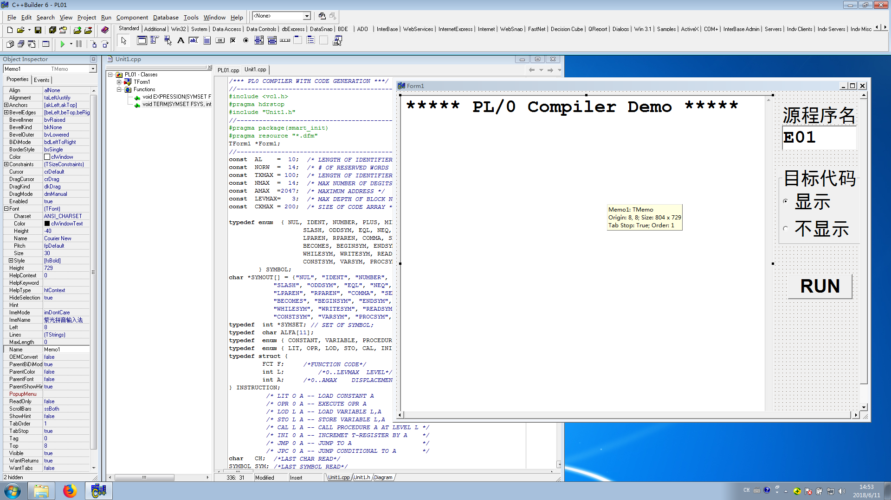
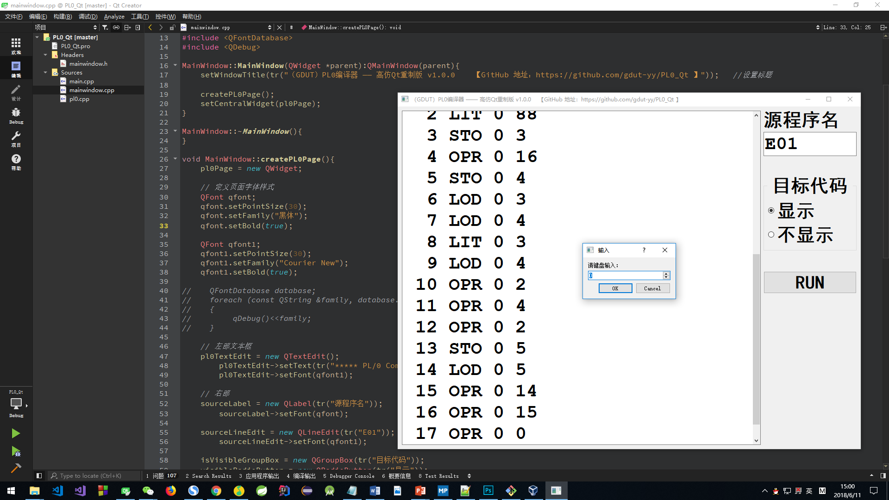

# PL/0 语言编译系统 HomePage

## 一、INDEX

| 目录 | 说明 |
| - | - |
| [PL0_Raw](https://github.com/gdut-yy/PL0/tree/master/PL0_Raw) | 老师所提供的PL0项目（原始代码，实验和课设需在此基础上进行功能扩充） |
| [**PL0_Exp**](https://github.com/gdut-yy/PL0/tree/master/PL0_Exp) | **本人的实验报告项目** |
| [**PL0_Des**](https://github.com/gdut-yy/PL0/tree/master/PL0_Des) | **本人的课程设计项目** |
| [PL0_Cpp](https://github.com/gdut-yy/PL0_Cpp) | 教材附录A中的 PL/0代码（C版本）。（所用编译器是 VS2017） |
| [PL0_Java](https://github.com/gdut-yy/PL0/tree/master/PL0_Java) | PL0_Cpp 改写而成的 PL/0代码（Java版本）。（所用编译器是 eclipse） |
| [**PL0_Qt**](https://github.com/gdut-yy/PL0_Qt) | **本人的 Qt 高仿重制版** |

## 二、关于本项目

本项目源于 本人大三下学期 编译原理课程 的课内实验和课程设计。课程用书是 清华大学出版社的《编译原理（第3版）》。

尽管当下已是8102年，微软刚刚完成对GitHub的收购，但这门课的 实验和课设 还依旧沿用着“祖传代码”，虽然比起教材后面的源码要好一点（真的只是一点，多了个GUI界面），但Borland C++Builder 6 这个编译器实在是太旧了，作为曾经 T1级别的编译器，在现在这个智能编译器满天飞的时代高下立见，附图为Borland C++Builder 6界面。在Windows 10 版本更新到 1803的今天，由于Borland C++Builder 6的兼容性问题，本人只能专门安装一个 Windows 7的虚拟机 去完成这个 实验和课设。并使用Qt去重写了它，考虑到答辩的原因，还是要在老师的原代码上进行操作，唉~

不过吐槽归吐槽，PL/0 语言编译系统 的源码思想才是最重要的，就算用Qt重写，也不过是换了个壳而已，核心的东西依然没变，所以还是要把精力放在源码上。

欢迎各位交流学习，谢谢~

## 三、Borland C++Builder 6 与 Qt Creator 4.5.0

## 四、实验环境和工具

	1、源语言：PL/0语言，PL/0语言是PASCAL语言的子集，它的编译程序是一个编译解析执行系统，后缀名为.PL0；
	2、目标语言：生成文件后缀为*.COD的目标代码 
	3、实现平台：Borland C++ Builder 6 
	4、运行平台：Windows 7 64位 

## 五、课内实验和课程设计内容和要求
 
	1. 课内实验

		对PL/0作以下修改扩充：
		（1）增加单词：保留字 ELSE，FOR，STEP，UNTIL，DO,RETURN 
		             运算符 *=，/=，&，||，！  
		（2）修改单词：不等号# 改为 <>
		（3）增加条件语句的ELSE子句，要求：写出相关文法，语法描述图，语义描述图。
	 
	2. 课程设计

		基本内容（成绩范围：“中”、“及格”或“不及格”）
		（1）扩充赋值运算：*= 和 /=
		（2）扩充语句（Pascal的FOR语句）:
		 FOR <变量>:=<表达式>STEP<表达式UNTIL<表达式>Do<语句>
	 
		选做内容（成绩评定范围扩大到：“优”和“良”）
		（1）增加类型：① 字符类型；  ② 实数类型。
		（2）扩充运算：++ 和 --（要求作为表达式实现） 
		（3）扩充函数：① 有返回值和返回语句；② 有参数函数。   
		（4）增加一维数组类型（可增加指令）。   
		（5）其他典型语言设施。         
